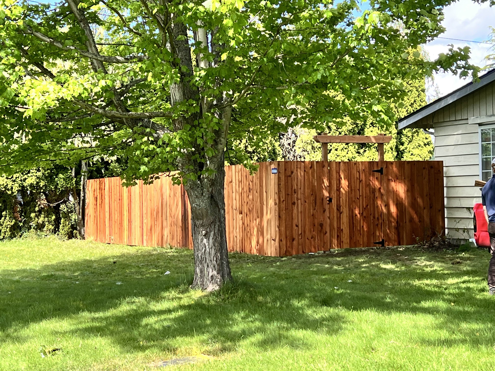
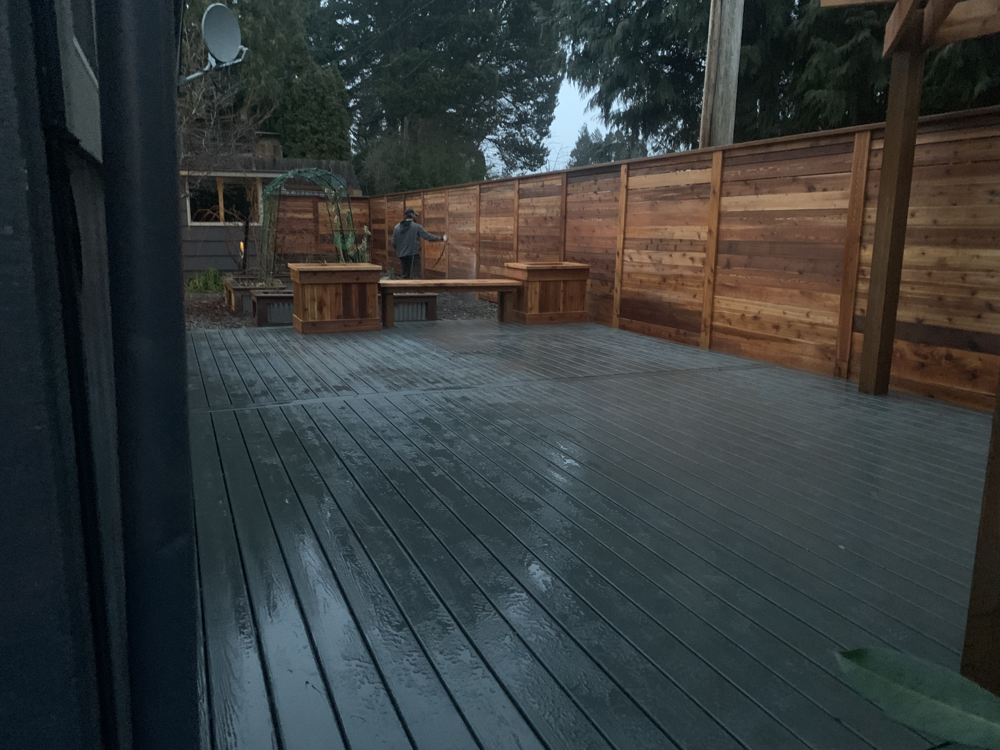
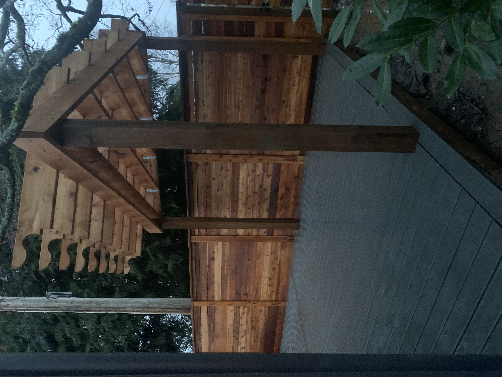
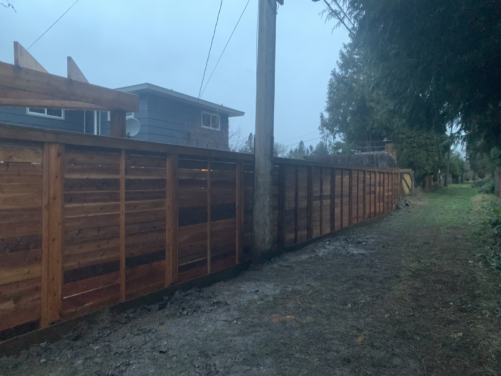

## Gallery

This gallery showcases a selection of completed residential construction projects from my time as a **Carpenter Foreman at Fence Brothers** in Bellingham, Washington. I was responsible for leading build crews, interpreting plans, managing materials, and ensuring structural accuracy and finish quality. The images focus on final results and representative builds rather than step-by-step documentation.

## Fences

## Decks

## My Truck and I

